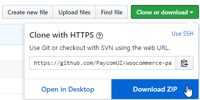
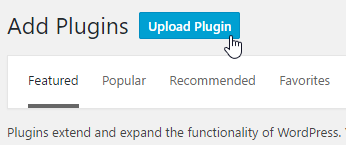
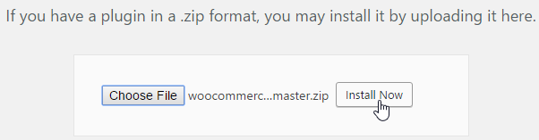
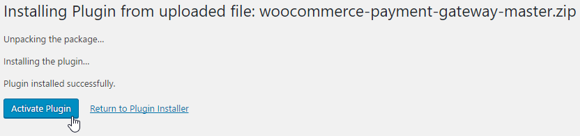
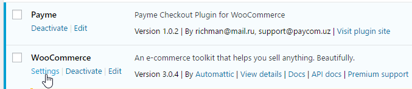
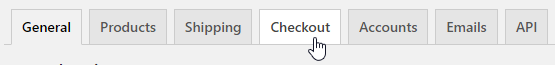
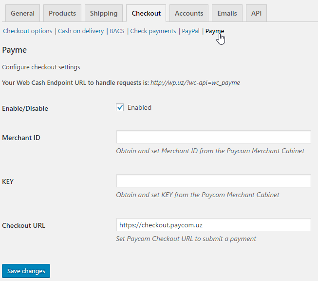
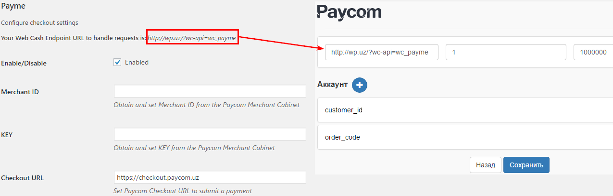

# WooCommerce plugin for Payme

## Installation

#### Prerequisites

- [WordPress 4.x](https://wordpress.org/)
- [WooCommerce 3.x](https://woocommerce.com/)
- Web Cash Desk from [Paycom](http://paycom.uz/)

#### GitHub

Download plugin source code as ZIP Archive

Upload plugin manually

...and install it

Activate it after installation

Go to the WooCommerce `Settings` page

Open `Checkout` tab

Change current tab to `Payme` and fill out settings.

There you can get your `Endpoint URL` and set it in the Web Cash Desk settings at Paycom.

To be continued...